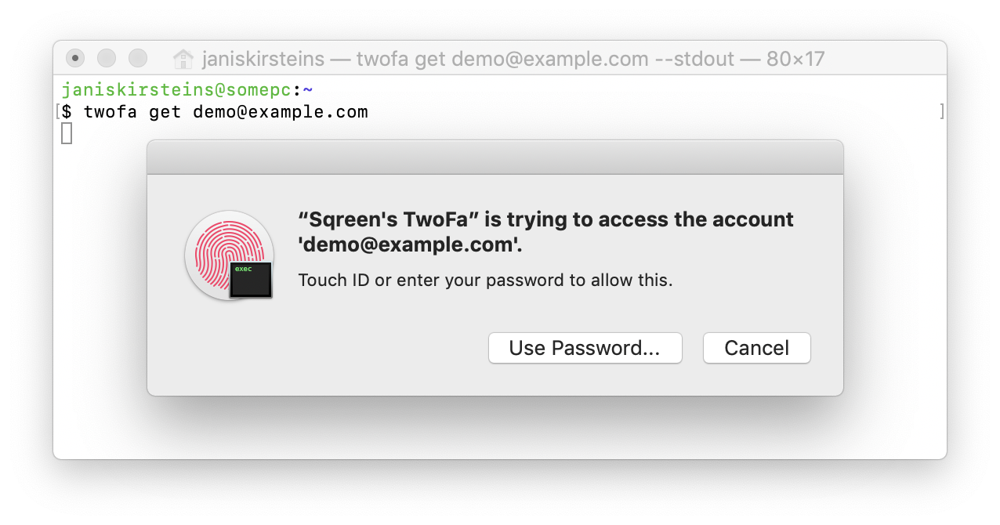
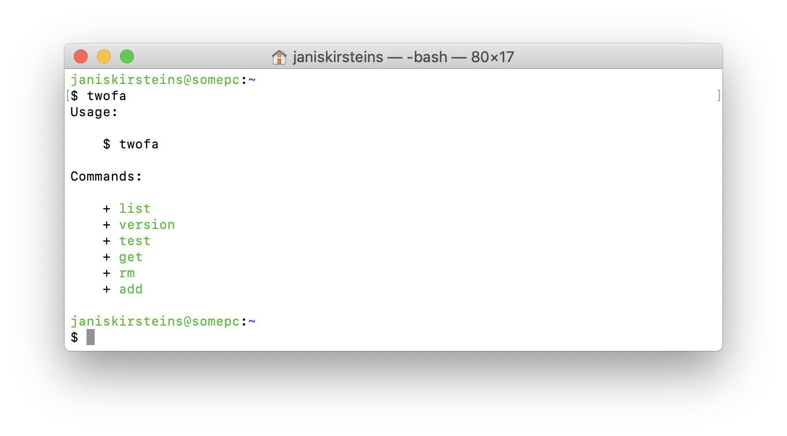

<h1 align="center">twofa</h1>

<p align="center">
  TouchID-aware 2-factor authentication for macOS
</p>

<p align="center">
  <small>Licenced under an MIT licence.</small> | Maintainer: <a href="mailto:janis@sqreen.com">Jānis Kiršteins &lt;janis@sqreen.com&gt;</a> (<a href="https://twitter.com/jkirsteins">@jkirsteins</a>)</p>
  
<p align="center">Copyright &copy; 2019 Sqreen</p>



## Table of Contents

- [Overview](#overview)
  - [Supported macOS Versions](#supported-macos-versions)
  - [Info.plist](#info.plist)
  - [macOS entitlements](#macos-entitlements)
  - [Platform Support](#platform-support)
- [Usage](#usage)
  - [add](#add)
  - [list](#list)
  - [rm](#rm)
  - [test](#test)
  - [get](#get)
- [Installation](#installation)
- [Building from Source](#building-from-source)
  - [Before Building](#before-building)
  - [swift build](#swift-build)
  - [Xcode](#xcode)
- [Contributing](#contributing)

## Overview

`twofa` is written in Swift. It uses the macOS keychain API to store one-time password generation parameters using the [`.userPresence`](https://developer.apple.com/documentation/security/secaccesscontrolcreateflags/1392879-userpresence) constraint.

This constraint will require the user's password or TouchID to access the data.

**Note**: It is possible to register both [time-based (TOTP)](https://en.wikipedia.org/wiki/Time-based_One-time_Password_algorithm) and [HMAC-based (HOTP)](https://en.wikipedia.org/wiki/HMAC-based_One-time_Password_algorithm) accounts, but only TOTP code generation is implemented.

### Supported macOS Versions

Since Swift 5 does not support static linking of the Swift runtime anymore, then binaries built with Swift 5 should work without additional steps on Mojave 10.14.4 and later.

The versions released on Homebrew will be built using Swift 4 and should run on all Mojave versions.

Earlier macOS versions will not be tested.

### Info.plist

An Info.plist is embedded into the binary during linking, and the `version` command will read the bundle version from that.

### macOS entitlements

The macOS keychain API requires the binary to be codesigned and contain appropriate entitlements.

Since this is a command-line utility, some extra work needs to be done to perform a functioning build:

- obtain a valid macOS codesigning key (obtainable from the [Apple Developer website](https://developer.apple.com/account))
  - install the corresponding provisioning profile locally, or the binary will not run for you
  - to have the binary work when distributed, you will need to sign with a `Developer ID` app distribution key
- find out your team ID (e.g. similar to `N2JEMR5FZG`)
- configure the file `Supporting/twofa.entitlements` to contain:
  - a valid application identifier
  - your team identifier
  - a valid keychain access group
- codesign the binary after building using `codesign` and embed the entitlements from `Supporting/twofa.entitlements` into it

**NOTE**: codesigning is required even when developing locally, otherwise the keychain API will not work

### Platform Support

Only macOS is supported and tested.

However, it should be possible to add Linux support using a different underlying keychain API.

## Usage

> If you want to test the app with a test account, you can use http://security-totp.appspot.com



What you want to do normally is run:

    $ twofa add

And then take a screenshot (to the pasteboard, not to a file - i.e. using `Command-Control-Shift-4`) of a QR code containing your OTP (one-time password) seed.

It should print out that some data was found, and that it is adding an account with the name from the QR code. E.g.:

    Found: test@security-totp.appspot.com

Then, to get the OTP, type:

```bash
# substitute the last argument with your actual account name
twofa get test@security-totp.appspot.com
```

The OTP will not be output by default, and instead will be put directly into the pasteboard.

(After the application terminates, the previous pasteboard content will be restored.)

### add

    $ twofa add [--label <label> --secret <secret>] [--uri <otpauth_uri>] [--debug]

You can call this with no extra arguments, and the default behaviour will be to wait for a valid screenshot to appear in the pasteboard of your Mac.

However, you can also provide the label and secret directly:

```bash
twofa add --label account_name --secret LZYSI2TSMRSWOYJSPEYSM5Q
```

You can also provide an [`otpauth://` URI](https://github.com/google/google-authenticator/wiki/Key-Uri-Format):

```bash
twofa add --uri otpauth://totp/avi-9605?secret=LZYSI2TSMRSWOYJSPEYSM5Q&issuer=SparkPost
```

Finally, if you add `--debug` then the parsed data will be output to `stdout` so you can see what is being stored in the keychain. **This is not recommended normally, as it will leave sensitive data in your history.**

This command does not require authentication.

### list

    $ twofa list

`twofa list` will list all the account labels that you have added. It will require authentication (unless there are no accounts added, in which case it will print out nothing and not ask for authentication).

### rm

    $ twofa rm <label>

`twofa rm account_name` will remove the specified account name from the keychain.

This will require authentication (although the keychain itself does not require authentication for item removal)

### test

    $ twofa test

This is a handy method just to check if the entitlements are correct, and the application is authorized to access the keychain.

It should ask for authentication, and print `OK`.

### get

    $ twofa get <label> [--stdout]

This will calculate the current OTP for the specified account, and copy it to the pasteboard.

Pasteboard content will be restored once the application closes.

If the application is not closed, it will automatically terminate in a short while on its own (so you can not forget it running in the background).

By default, it will not output the codes to `stdout`, however if you pass the `--stdout` flag, then the code will be output in addition to being put into the pasteboard.

## Installation

To install a pre-built binary, you will need [Homebrew](https://brew.sh):

    $ brew tap sqreen/speakeasy
    $ brew install twofa

## Building from Source

### Before Building

Before you build, you must:

- edit `Supporting/Info.plist` (optional)
- edit `Supporting/twofa.entitlements` (**important**)
- edit `build.sh` and `regen.sh` and replace the code sign identity string with the value corresponding to your Apple-issued key that you will use to codesign

### swift build

If you want to build using `swift build`, you can use the script `build.sh`. It will:

- build a release version
- embed the Info.plist into it
- codesign it with the entitlements file

### Xcode

If you want to use Xcode, you can use the accompanying `regen.rb` script to generate a valid Xcode project.

It invokes `swift package generate-xcodeproj` and then applies configuration changes to:

- embed the Info.plist into the binary after building
- use the correct entitlements file
- set the correct signing identity

## Contributing

Contributions are welcomed and encouraged! Take a look at the [contribution guidelines](CONTRIBUTING).
